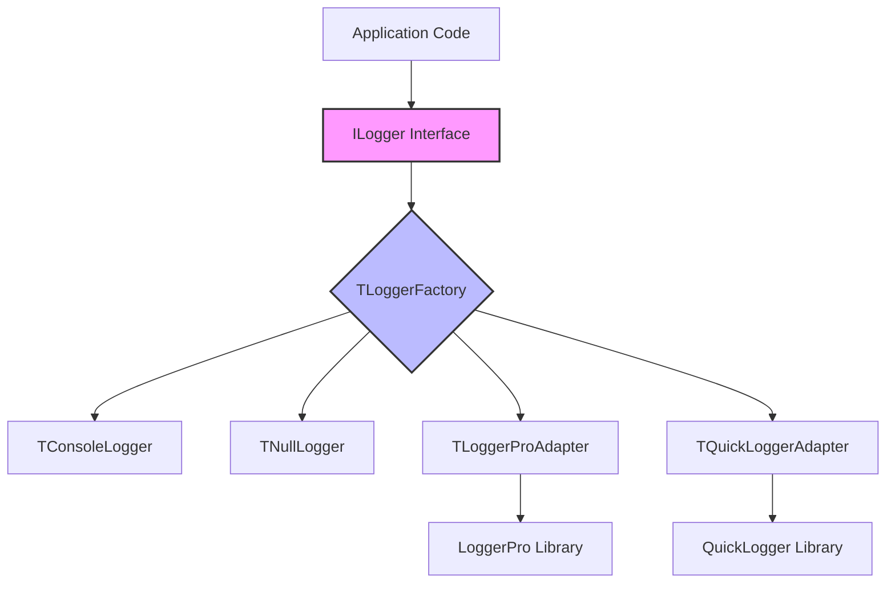

# LoggingFacade for Delphi

A flexible, SLF4J-inspired logging facade for Delphi that decouples application code from specific logging implementations through a clean interface-based architecture.

## Table of Contents

- [Overview](#overview)
- [Key Features](#key-features)
- [Architecture](#architecture)
- [Core Concepts](#core-concepts)
  - [Hierarchical Logger System](#hierarchical-logger-system)
  - [Log Levels](#log-levels)
  - [Configuration System](#configuration-system)
  - [Stack Trace Support](#stack-trace-support)
- [Installation](#installation)
  - [Dynamic Linking (BPL)](#dynamic-linking-bpl)
  - [Static Linking (Source Files)](#static-linking-source-files)
- [Quick Start Guide](#quick-start-guide)
- [Advanced Usage](#advanced-usage)
  - [Using LoggerPro Adapter](#using-loggerpro-adapter)
  - [Using QuickLogger Adapter](#using-quicklogger-adapter)
  - [Custom Logger Implementation](#custom-logger-implementation)
  - [Stack Trace Configuration](#stack-trace-configuration)
- [Configuration Reference](#configuration-reference)
- [API Reference](#api-reference)
- [Examples](#examples)
- [Best Practices](#best-practices)
- [Troubleshooting](#troubleshooting)
- [Migration Guide](#migration-guide)

## Overview

LoggingFacade provides a unified logging interface for Delphi applications, allowing you to write code against a common API while switching between different logging implementations as needed. Inspired by SLF4J (Simple Logging Facade for Java) and Logback, it brings enterprise-grade logging patterns to the Delphi ecosystem.

### When to Use LoggingFacade

- **Large applications** with multiple teams or modules that need consistent logging
- **Library development** where you don't want to force a specific logging library on users
- **Migration scenarios** when transitioning between logging implementations
- **Microservices** that need different logging strategies per service
- **Testing environments** where you need to easily disable or mock logging

### When to Use Direct Library Access

- **Simple applications** with straightforward logging needs
- **Performance-critical paths** where the facade overhead matters (though it's minimal)
- **When using library-specific features** not exposed through the facade

## Key Features

- **🎭 Interface-Based Design**: Application code depends only on `ILogger` interface
- **🌳 Hierarchical Logger Names**: SLF4J/Logback-style hierarchical logger management
- **⚙️ External Configuration**: Properties files with hierarchical resolution and wildcards
- **🔄 Hot Reload**: Runtime configuration changes without restart
- **📚 Multiple Implementations**: Console, Null, LoggerPro, QuickLogger adapters
- **🔍 Stack Trace Support**: Optional exception stack traces with JCL Debug
- **📦 Modular Architecture**: Separate packages for core and adapters
- **🔒 Thread-Safe**: Concurrent-safe factory and configuration
- **⚡ Performance Optimized**: Logger caching, lazy initialization
- **🌍 Cross-Platform**: Windows, Linux, macOS support

## Architecture

LoggingFacade implements the **Facade Pattern** to provide a simplified, unified interface to various logging subsystems:



### Design Principles

1. **Facade Pattern**: Single interface (`ILogger`) hiding implementation complexity
2. **Factory Pattern**: Centralized logger creation via `TLoggerFactory`
3. **Singleton Pattern**: Single factory instance with cached loggers
4. **Adapter Pattern**: Bridges to external logging libraries
5. **Registry Pattern**: Dynamic provider registration for stack traces

### Component Architecture

#### Core Package (LoggingFacade.bpl)
- `Logger.Intf.pas` - Core `ILogger` interface
- `Logger.Factory.pas` - Factory with hierarchical logger management
- `Logger.Config.pas` - Configuration file parser with wildcards
- `Logger.Types.pas` - Common types and log levels
- `Logger.Default.pas` - Console logger implementation
- `Logger.Null.pas` - Null logger (no output)
- `Logger.StackTrace.pas` - Stack trace registry

#### Adapter Packages
- `LoggingFacade.LoggerPro.bpl` - LoggerPro integration
- `LoggingFacade.QuickLogger.bpl` - QuickLogger integration
- `LoggingFacade.StackTrace.JclDebug.bpl` - JCL Debug provider

## Core Concepts

### Hierarchical Logger System

**This is the most powerful feature of LoggingFacade** - a hierarchical logger naming system similar to SLF4J/Logback that enables fine-grained control over logging output.

#### How It Works

Loggers are organized in a hierarchical namespace using dot notation, similar to Java packages or .NET namespaces:

```delphi
// Get hierarchical named loggers
var
  AppLogger := TLoggerFactory.GetLogger('MyApp');
  DbLogger := TLoggerFactory.GetLogger('MyApp.Database');
  ConnLogger := TLoggerFactory.GetLogger('MyApp.Database.Connection');
  RepoLogger := TLoggerFactory.GetLogger('MyApp.Database.Repository');
  ApiLogger := TLoggerFactory.GetLogger('MyApp.API.REST');
```

Each logger inherits configuration from its parent in the hierarchy:
- `MyApp.Database.Connection` inherits from `MyApp.Database`
- `MyApp.Database` inherits from `MyApp`
- `MyApp` inherits from root

#### Logger Instance Caching

`TLoggerFactory` maintains a cache of logger instances for performance:

```delphi
// First call creates and caches the logger
var Logger1 := TLoggerFactory.GetLogger('MyApp.Database');

// Subsequent calls return the cached instance (very fast)
var Logger2 := TLoggerFactory.GetLogger('MyApp.Database');

// Logger1 and Logger2 are the same instance
Assert(Logger1 = Logger2);
```

#### Configuration with Hierarchical Resolution

Configure loggers using properties files with hierarchical matching:

```properties
# Root logger - fallback for everything
root=INFO

# Configure entire application at DEBUG
MyApp=DEBUG

# But database layer needs only INFO
MyApp.Database=INFO

# Except connection pool which needs TRACE for debugging
MyApp.Database.ConnectionPool=TRACE

# Configure all API endpoints with wildcard
MyApp.API.*=WARN

# But REST endpoints need DEBUG
MyApp.API.REST=DEBUG
```

#### Wildcard Pattern Matching

Use wildcards to configure multiple loggers at once:

```properties
# Configure all MQTT components
mqtt.*=DEBUG

# Configure all transport layers
mqtt.transport.*=TRACE

# Configure all database repositories
app.database.repository.*=INFO
```

**Resolution Rules:**
1. **Exact match wins** - `MyApp.Database.Connection` matches exactly
2. **Most specific wildcard** - `MyApp.Database.*` beats `MyApp.*`
3. **Inheritance** - Falls back to parent or root if no match

#### Practical Example

```delphi
program HierarchicalLoggingDemo;

uses
  Logger.Factory, Logger.Intf, Logger.Types;

procedure InitializeLogging;
begin
  // Configuration (usually from .properties file)
  TLoggerFactory.SetLoggerLevel('app', llInfo);
  TLoggerFactory.SetLoggerLevel('app.database.*', llDebug);
  TLoggerFactory.SetLoggerLevel('app.database.connection', llTrace);
  TLoggerFactory.SetLoggerLevel('app.business', llWarn);
  TLoggerFactory.SetLoggerLevel('app.api.*', llError);
end;

// In your database layer
procedure DatabaseOperation;
var
  Logger: ILogger;
begin
  Logger := TLoggerFactory.GetLogger('app.database.connection');

  Logger.Trace('Opening connection...'); // Shows (TRACE level)
  Logger.Debug('Executing query: SELECT * FROM users'); // Shows
  Logger.Info('Query executed successfully'); // Shows
end;

// In your business layer
procedure BusinessLogic;
var
  Logger: ILogger;
begin
  Logger := TLoggerFactory.GetLogger('app.business.orders');

  Logger.Debug('Processing order...'); // Hidden (WARN level)
  Logger.Info('Order processed'); // Hidden
  Logger.Warn('Inventory low'); // Shows
end;

// In your API layer
procedure ApiEndpoint;
var
  Logger: ILogger;
begin
  Logger := TLoggerFactory.GetLogger('app.api.users');

  Logger.Info('API called'); // Hidden (ERROR level)
  Logger.Error('Authentication failed'); // Shows
end;

begin
  InitializeLogging;
  DatabaseOperation;
  BusinessLogic;
  ApiEndpoint;
end.
```

#### Best Practices for Logger Naming

1. **Use package/unit structure**: Mirror your code organization
   ```delphi
   'MyApp.UI.MainForm'
   'MyApp.Business.OrderProcessor'
   'MyApp.Database.CustomerRepository'
   ```

2. **Keep names consistent**: Use the same naming convention throughout
   ```delphi
   // Good - consistent
   'app.database.connection'
   'app.database.repository'
   'app.database.migration'

   // Bad - inconsistent
   'app.DB.connection'
   'app.database.repo'
   'app.data.migration'
   ```

3. **Create logger constants**: Define logger names in one place
   ```delphi
   const
     LOGGER_APP = 'myapp';
     LOGGER_DATABASE = 'myapp.database';
     LOGGER_API = 'myapp.api';
   ```

4. **One logger per class**: Each class gets its own logger
   ```delphi
   type
     TOrderService = class
     private
       FLogger: ILogger;
     public
       constructor Create;
     end;

   constructor TOrderService.Create;
   begin
     FLogger := TLoggerFactory.GetLogger('MyApp.Business.OrderService');
   end;
   ```

### Log Levels

LoggingFacade supports six log levels, ordered from most verbose to most severe:

| Level | Usage | Example |
|-------|-------|---------|
| **TRACE** | Very detailed information, typically only enabled during development | Method entry/exit, variable values |
| **DEBUG** | Detailed information useful for debugging | SQL queries, configuration values |
| **INFO** | General informational messages | Application startup, feature usage |
| **WARN** | Potentially harmful situations | Deprecated API usage, poor performance |
| **ERROR** | Error events that might still allow the application to continue | Failed operations, invalid input |
| **FATAL** | Very severe error events that will presumably lead the application to abort | Out of memory, critical resource unavailable |

#### Level Filtering

Each logger has a minimum level - messages below this level are discarded:

```delphi
var Logger := TLoggerFactory.GetLogger('MyApp');
Logger.SetLevel(llInfo);

Logger.Trace('Hidden');  // Not logged
Logger.Debug('Hidden');  // Not logged
Logger.Info('Visible');  // Logged
Logger.Warn('Visible');  // Logged
```

#### Performance Optimization with Level Checks

Always check if a level is enabled before expensive operations:

```delphi
// Bad - always builds the expensive string
Logger.Debug('Data: ' + ExpensiveDataDump());

// Good - only builds string if DEBUG is enabled
if Logger.IsDebugEnabled then
  Logger.Debug('Data: ' + ExpensiveDataDump());
```

### Configuration System

The configuration system supports external `.properties` files with hierarchical resolution, inspired by Logback.

#### Automatic Configuration Loading

Configuration files are automatically loaded based on build mode:
- **DEBUG builds**: Looks for `logging-debug.properties`
- **RELEASE builds**: Looks for `logging.properties`

Search order:
1. Current directory
2. Executable directory
3. Parent of executable directory

#### Properties File Format

```properties
# Comments start with # or !
# Format: logger.name=LEVEL

# Root logger (fallback for all unconfigured loggers)
root=INFO

# Exact logger configuration
app.database.connection=DEBUG
app.business.orderservice=TRACE

# Wildcard patterns
app.database.*=INFO
mqtt.*=DEBUG
*.repository=WARN

# Configuration is case-insensitive
MyApp.Main=DEBUG  # same as myapp.main=DEBUG
```

#### Hierarchical Resolution Example

Given this configuration:
```properties
root=WARN
app.*=INFO
app.database.*=DEBUG
app.database.connection=TRACE
app.database.repository.*=INFO
app.database.repository.orders=DEBUG
```

Resolution results:
| Logger Name | Resolved Level | Matching Rule |
|-------------|---------------|---------------|
| `some.other.logger` | WARN | root |
| `app.ui.mainform` | INFO | app.* |
| `app.database.migration` | DEBUG | app.database.* |
| `app.database.connection` | TRACE | app.database.connection (exact) |
| `app.database.repository.customers` | INFO | app.database.repository.* |
| `app.database.repository.orders` | DEBUG | app.database.repository.orders (exact) |

#### Runtime Configuration Changes

Change logger levels at runtime without restarting:

```delphi
// Change single logger
TLoggerFactory.SetLoggerLevel('app.database', llTrace);

// Change with wildcard
TLoggerFactory.SetLoggerLevel('app.api.*', llError);

// Reload configuration file
TLoggerFactory.ReloadConfig;
```

### Stack Trace Support

LoggingFacade provides optional stack trace capture for exceptions through a modular provider system.

#### Architecture

The stack trace system uses a **Registry Pattern** with lazy initialization:

```delphi
// Provider registration (happens automatically)
TStackTraceManager.RegisterProviderClass(TJclDebugProvider);

// Usage in logger
procedure TConsoleLogger.Error(const AMessage: string; AException: Exception);
begin
  LogMessage(llError, AMessage);
  if TStackTraceManager.IsAvailable then
    LogMessage(llError, TStackTraceManager.GetStackTrace(AException));
end;
```

#### Two Usage Modes

1. **Dynamic BPL Loading** (Recommended for production):
   ```delphi
   uses
     Logger.StackTrace.Loader; // Auto-loads BPL at startup
   ```

2. **Static Linking** (For development/debugging):
   ```delphi
   uses
     Logger.StackTrace.JclDebug; // Direct dependency on JCL
   ```

#### Security Considerations

Stack traces are automatically disabled in RELEASE builds unless explicitly enabled:

```delphi
// Only available in DEBUG or when debugger attached
if IsDebugMode then
  LoadStackTraceProvider;
```

## Installation

LoggingFacade can be installed using either dynamic linking (BPL packages) or static linking (source files).

### Dynamic Linking (BPL)

Best for shared components across multiple applications.

#### 1. Compile the Packages

Open each `.dpk` file in Delphi and compile (Shift+F9):

- `packages\LoggingFacade.dpk` → Core framework
- `packages\LoggingFacade.LoggerPro.dpk` → LoggerPro adapter (optional)
- `packages\LoggingFacade.QuickLogger.dpk` → QuickLogger adapter (optional)
- `packages\LoggingFacade.StackTrace.JclDebug.dpk` → Stack traces (optional)

#### 2. Deploy BPL Files

Copy the generated `.bpl` files to:
- System PATH directory, or
- Application directory

#### 3. Configure Your Project

In Project Options → Packages → Runtime Packages:
- Check "Link with runtime packages"
- Add package names (without .bpl extension):
  ```
  LoggingFacade;LoggingFacade.LoggerPro
  ```

### Static Linking (Source Files)

Best for single applications or when you want to avoid BPL deployment.

#### 1. Add Source Path

In Project Options → Delphi Compiler → Search Path, add:
```
..\LoggingFacade\src
```

#### 2. Add Units to Your Code

```delphi
uses
  Logger.Intf,
  Logger.Factory,
  Logger.Types,
  Logger.Default;  // Or other implementations
```

#### Comparison: BPL vs Source

| Aspect | BPL (Dynamic) | Source (Static) |
|--------|---------------|-----------------|
| **Executable Size** | Smaller | Larger |
| **Deployment** | Requires BPL files | Single EXE |
| **Shared Code** | Yes, across apps | No |
| **Updates** | Update BPL only | Recompile all apps |
| **Debugging** | More complex | Straightforward |
| **Best For** | Multiple apps, plugins | Single apps |

## Quick Start Guide

### Minimal Example

```delphi
program QuickStart;

uses
  Logger.Factory, Logger.Intf;

var
  Logger: ILogger;
begin
  // Get a logger (uses default console logger)
  Logger := TLoggerFactory.GetLogger('MyApp');

  // Log messages
  Logger.Info('Application started');
  Logger.Debug('Processing data...');
  Logger.Error('Something went wrong!');
end.
```

### With Configuration

Create `logging.properties`:
```properties
root=WARN
MyApp=DEBUG
MyApp.Database=TRACE
```

```delphi
program ConfiguredLogging;

uses
  Logger.Factory, Logger.Intf, Logger.Types;

type
  TDatabaseManager = class
  private
    FLogger: ILogger;
  public
    constructor Create;
    procedure Connect;
  end;

constructor TDatabaseManager.Create;
begin
  FLogger := TLoggerFactory.GetLogger('MyApp.Database');
end;

procedure TDatabaseManager.Connect;
begin
  FLogger.Debug('Connecting to database...');
  // Connection logic
  FLogger.Info('Connected successfully');
end;

var
  DbManager: TDatabaseManager;
begin
  // Configuration loads automatically from logging.properties

  DbManager := TDatabaseManager.Create;
  try
    DbManager.Connect;
  finally
    DbManager.Free;
  end;
end.
```

### With Named Loggers

```delphi
program NamedLoggers;

uses
  Logger.Factory, Logger.Intf;

procedure ProcessOrder(OrderId: Integer);
var
  Logger: ILogger;
begin
  Logger := TLoggerFactory.GetLogger('MyApp.Business.OrderProcessor');

  Logger.Info('Processing order #%d', [OrderId]);
  Logger.Debug('Validating order items...');
  Logger.Debug('Calculating totals...');
  Logger.Info('Order processed successfully');
end;

procedure UpdateInventory;
var
  Logger: ILogger;
begin
  Logger := TLoggerFactory.GetLogger('MyApp.Business.Inventory');

  Logger.Info('Updating inventory levels');
  Logger.Warn('Low stock for product SKU-123');
end;

begin
  ProcessOrder(1001);
  UpdateInventory;
end.
```

### Exception Logging with Stack Traces

```delphi
program ExceptionLogging;

uses
  System.SysUtils,
  Logger.Factory, Logger.Intf,
  Logger.StackTrace.Loader;  // Enable stack traces

procedure RiskyOperation;
var
  Logger: ILogger;
begin
  Logger := TLoggerFactory.GetLogger('MyApp.Critical');

  try
    // Something that might fail
    raise Exception.Create('Database connection lost');
  except
    on E: Exception do
    begin
      Logger.Error('Operation failed', E);  // Logs with stack trace
      raise;
    end;
  end;
end;

begin
  try
    RiskyOperation;
  except
    on E: Exception do
      WriteLn('Application error: ' + E.Message);
  end;
end.
```

## Advanced Usage

### Using LoggerPro Adapter

LoggerPro provides high-performance asynchronous logging with multiple appenders.

```delphi
program LoggerProExample;

uses
  Logger.Factory,
  Logger.Intf,
  Logger.LoggerPro.Factory,  // Helper for LoggerPro setup
  LoggerPro,                  // LoggerPro library
  LoggerPro.FileAppender;     // File output

begin
  // Configure LoggerPro with file appender
  var LogWriter := BuildLogWriter([
    TLoggerProFileAppender.Create(10, 5000, 'logs', [], TEncoding.UTF8)
  ]);

  // Create adapter factory
  TLoggerFactory.SetNamedLoggerFactory(
    function(const AName: string): ILogger
    begin
      Result := TLoggerProAdapter.Create(AName, LogWriter);
    end
  );

  // Use as normal
  var Logger := TLoggerFactory.GetLogger('MyApp');
  Logger.Info('Using LoggerPro backend!');
end.
```

### Using QuickLogger Adapter

QuickLogger offers extensive providers for various outputs.

```delphi
program QuickLoggerExample;

uses
  Logger.Factory,
  Logger.Intf,
  Logger.QuickLogger.Adapter,
  Quick.Logger,
  Quick.Logger.Provider.Files,
  Quick.Logger.Provider.Console;

begin
  // Configure QuickLogger
  Logger.Providers.Add(GlobalLogFileProvider);
  Logger.Providers.Add(GlobalLogConsoleProvider);

  GlobalLogFileProvider.FileName := 'app.log';
  GlobalLogFileProvider.Enabled := True;

  GlobalLogConsoleProvider.Enabled := True;
  GlobalLogConsoleProvider.ShowColors := True;

  // Set up adapter factory
  TLoggerFactory.SetNamedLoggerFactory(
    function(const AName: string): ILogger
    begin
      Result := TQuickLoggerAdapter.Create(AName);
    end
  );

  // Use facade interface
  var AppLogger := TLoggerFactory.GetLogger('MyApp');
  AppLogger.Info('QuickLogger backend active');
end.
```

### Custom Logger Implementation

Create your own logger by implementing the `ILogger` interface:

```delphi
unit MyCustomLogger;

interface

uses
  Logger.Intf, Logger.Types, System.SysUtils;

type
  TDatabaseLogger = class(TInterfacedObject, ILogger)
  private
    FName: string;
    FMinLevel: TLogLevel;
    procedure WriteToDatabase(ALevel: TLogLevel; const AMessage: string);
  public
    constructor Create(const AName: string);

    // ILogger implementation
    procedure Trace(const AMessage: string); overload;
    procedure Trace(const AMessage: string; const AArgs: array of const); overload;
    // ... implement all ILogger methods ...

    function IsTraceEnabled: Boolean;
    // ... implement all level check methods ...

    procedure SetLevel(ALevel: TLogLevel);
    function GetLevel: TLogLevel;
    function GetName: string;
  end;

implementation

constructor TDatabaseLogger.Create(const AName: string);
begin
  FName := AName;
  FMinLevel := llInfo;
end;

procedure TDatabaseLogger.WriteToDatabase(ALevel: TLogLevel; const AMessage: string);
begin
  // Insert log entry into database
  // ExecuteSQL('INSERT INTO logs (level, logger, message) VALUES (?, ?, ?)',
  //   [ALevel.ToString, FName, AMessage]);
end;

procedure TDatabaseLogger.Info(const AMessage: string);
begin
  if FMinLevel <= llInfo then
    WriteToDatabase(llInfo, AMessage);
end;

// ... implement other methods ...

end.
```

Register your custom logger:

```delphi
TLoggerFactory.SetNamedLoggerFactory(
  function(const AName: string): ILogger
  begin
    Result := TDatabaseLogger.Create(AName);
  end
);
```

### Stack Trace Configuration

#### Dynamic Loading (Production)

```delphi
uses
  Logger.StackTrace.Loader;  // Auto-loads at initialization

begin
  // Stack traces automatically available if BPL found
  var Logger := TLoggerFactory.GetLogger('MyApp');
  try
    raise Exception.Create('Test error');
  except
    on E: Exception do
      Logger.Error('Operation failed', E);  // Includes stack trace
  end;
end.
```

#### Static Linking (Development)

```delphi
uses
  Logger.StackTrace.JclDebug;  // Direct JCL dependency

begin
  // Stack traces available immediately
  TStackTraceManager.Enable;

  var Logger := TLoggerFactory.GetLogger('MyApp');
  // Use as above
end.
```

#### Manual Control

```delphi
// Check availability
if TStackTraceManager.IsAvailable then
  WriteLn('Stack traces enabled')
else
  WriteLn('Stack traces not available');

// Enable/disable at runtime
TStackTraceManager.Disable;  // Temporarily disable
TStackTraceManager.Enable;   // Re-enable

// Get current stack
var Stack := TStackTraceManager.GetCurrentStackTrace;
Logger.Debug('Current call stack: ' + Stack);
```

## Configuration Reference

### Properties File Syntax

```properties
# Comment line
! Alternative comment

# Root logger
root=LEVEL

# Named logger
logger.name=LEVEL

# Wildcard pattern
logger.prefix.*=LEVEL

# Levels: TRACE, DEBUG, INFO, WARN, ERROR, FATAL
```

### Configuration Options

| Property | Description | Example |
|----------|-------------|---------|
| `root` | Default level for all loggers | `root=INFO` |
| `*` | Same as root | `*=WARN` |
| `name` | Exact logger name | `myapp.database=DEBUG` |
| `prefix.*` | All loggers starting with prefix | `myapp.*=INFO` |
| `*.suffix` | All loggers ending with suffix | `*.repository=DEBUG` |

### Configuration Precedence

1. Exact match (highest priority)
2. Longest matching wildcard
3. Shorter wildcards
4. Root logger (lowest priority)

### Runtime Configuration API

```delphi
// Load configuration file
TLoggerFactory.LoadConfig('custom.properties');

// Reload current configuration
TLoggerFactory.ReloadConfig;

// Set level for specific logger
TLoggerFactory.SetLoggerLevel('app.database', llDebug);

// Set level with wildcard
TLoggerFactory.SetLoggerLevel('app.*', llInfo);

// Query configured level
var Level := TLoggerFactory.GetConfiguredLevel('app.database');

// Clear all configuration
TLoggerFactory.ClearConfig;
```

## API Reference

### TLoggerFactory

Central factory for creating and managing logger instances.

```delphi
class function GetLogger(const AName: string = ''): ILogger;
// Get a logger instance. Empty name returns root logger.

class procedure SetLoggerFactory(AFactoryFunc: TLoggerFactoryFunc);
// Set custom factory function for creating loggers.

class procedure SetLogger(ALogger: ILogger);
// Set a specific logger instance to use globally.

class procedure UseConsoleLogger(AMinLevel: TLogLevel = llInfo;
                                 AUseColors: Boolean = True);
// Configure factory to use console logger.

class procedure UseNullLogger;
// Configure factory to use null logger (no output).

class procedure LoadConfig(const AFileName: string = '');
// Load configuration from properties file.

class procedure ReloadConfig;
// Reload current configuration file.

class procedure SetLoggerLevel(const ALoggerName: string;
                              ALevel: TLogLevel);
// Set logger level at runtime.

class function GetConfiguredLevel(const ALoggerName: string;
                                 ADefaultLevel: TLogLevel = llInfo): TLogLevel;
// Get configured level for a logger name.
```

### ILogger Interface

Core logging interface that all loggers implement.

```delphi
// Logging methods
procedure Trace(const AMessage: string); overload;
procedure Trace(const AMessage: string; const AArgs: array of const); overload;

procedure Debug(const AMessage: string); overload;
procedure Debug(const AMessage: string; const AArgs: array of const); overload;

procedure Info(const AMessage: string); overload;
procedure Info(const AMessage: string; const AArgs: array of const); overload;

procedure Warn(const AMessage: string); overload;
procedure Warn(const AMessage: string; const AArgs: array of const); overload;

procedure Error(const AMessage: string); overload;
procedure Error(const AMessage: string; const AArgs: array of const); overload;
procedure Error(const AMessage: string; AException: Exception); overload;

procedure Fatal(const AMessage: string); overload;
procedure Fatal(const AMessage: string; const AArgs: array of const); overload;
procedure Fatal(const AMessage: string; AException: Exception); overload;

// Level checking
function IsTraceEnabled: Boolean;
function IsDebugEnabled: Boolean;
function IsInfoEnabled: Boolean;
function IsWarnEnabled: Boolean;
function IsErrorEnabled: Boolean;
function IsFatalEnabled: Boolean;

// Configuration
procedure SetLevel(ALevel: TLogLevel);
function GetLevel: TLogLevel;
function GetName: string;
```

### TStackTraceManager

Manages stack trace providers for exception logging.

```delphi
class procedure RegisterProviderClass(AClass: TStackTraceProviderClass);
// Register a provider class for lazy instantiation.

class procedure SetProvider(AProvider: IStackTraceProvider);
// Set provider instance directly.

class procedure Enable;
// Enable stack trace capture.

class procedure Disable;
// Disable stack trace capture.

class function IsAvailable: Boolean;
// Check if stack traces are available.

class function GetStackTrace(AException: Exception): string;
// Get stack trace for an exception.

class function GetCurrentStackTrace: string;
// Get current call stack.
```

## Examples

The project includes several example applications demonstrating different features:

### BasicExample
Simple introduction to logging with different levels and basic configuration.

```bash
examples\BasicExample\BasicExample.dpr
```

### ConfigExample
Demonstrates external configuration files, hierarchical resolution, and runtime changes.

```bash
examples\ConfigExample\ConfigExample.dpr
```

### HierarchicalDemo
Complex multi-layer application showing hierarchical loggers across different modules.

```bash
examples\HierarchicalDemo\HierarchyApp\HierarchyApp.dpr
```

### StackTraceExample
Shows exception logging with stack traces using JCL Debug.

```bash
examples\StackTraceExample\StackTraceExample.dpr
```

### LoggerProExample
Integration with LoggerPro library for high-performance logging.

```bash
examples\LoggerProExample\LoggerProExample.dpr
```

### QuickLoggerExample
Integration with QuickLogger for feature-rich logging.

```bash
examples\QuickLoggerExample\QuickLoggerExample.dpr
```

## Best Practices

### Logger Naming Conventions

1. **Mirror your code structure**
   ```delphi
   'MyApp.UI.Forms.MainForm'
   'MyApp.Business.Services.OrderService'
   'MyApp.Data.Repositories.CustomerRepository'
   ```

2. **Use constants for logger names**
   ```delphi
   const
     LOG_DATABASE = 'MyApp.Database';
     LOG_API = 'MyApp.API';
   ```

3. **One logger per class**
   ```delphi
   type
     TMyService = class
     private
       class var FLogger: ILogger;
     public
       class constructor Create;
     end;

   class constructor TMyService.Create;
   begin
     FLogger := TLoggerFactory.GetLogger('MyApp.Services.MyService');
   end;
   ```

### Performance Considerations

1. **Cache logger instances**
   ```delphi
   // Bad - creates logger every time
   procedure DoWork;
   begin
     TLoggerFactory.GetLogger('MyApp').Info('Working...');
   end;

   // Good - reuses cached instance
   var
     Logger: ILogger;

   procedure DoWork;
   begin
     if not Assigned(Logger) then
       Logger := TLoggerFactory.GetLogger('MyApp');
     Logger.Info('Working...');
   end;
   ```

2. **Check level before expensive operations**
   ```delphi
   if Logger.IsDebugEnabled then
   begin
     var Data := CollectDebugData();  // Expensive
     Logger.Debug('Data: ' + Data);
   end;
   ```

3. **Use format strings efficiently**
   ```delphi
   // Good - defers formatting
   Logger.Info('Order %d processed in %d ms', [OrderId, ElapsedMs]);

   // Less efficient - always formats
   Logger.Info(Format('Order %d processed in %d ms', [OrderId, ElapsedMs]));
   ```

### Configuration Management

1. **Separate configs for environments**
   ```
   logging-debug.properties     # Development
   logging.properties           # Production
   logging-test.properties      # Testing
   ```

2. **Start general, get specific**
   ```properties
   # Start with broad rules
   root=WARN
   app.*=INFO

   # Then add specific overrides
   app.database.connection=DEBUG
   app.critical.security=TRACE
   ```

3. **Document your configuration**
   ```properties
   # ===== Production Configuration =====
   # Root: WARN to minimize noise
   # Database: INFO for operations tracking
   # API: ERROR only for production stability

   root=WARN
   app.database=INFO
   app.api=ERROR
   ```

### Deployment Strategies

#### Development
- Use source files for easy debugging
- Enable TRACE/DEBUG levels
- Include stack trace support
- Use console logger for immediate feedback

#### Testing
- Use null logger for unit tests
- Mock ILogger interface for behavior testing
- Separate test configuration file

#### Production
- Use BPL packages for shared deployment
- Configure appropriate log levels (usually INFO/WARN)
- Use production-grade backend (LoggerPro/QuickLogger)
- Implement log rotation and archiving
- Consider performance impact of logging

## Troubleshooting

### Common Issues

#### Logger Shows Nothing
- **Check configuration file** exists and is loaded
- **Verify log level** - default is INFO, DEBUG/TRACE won't show
- **Ensure correct logger name** in configuration matches code

#### Configuration Not Loading
- **File location** - must be in current/exe directory
- **File name** - `logging-debug.properties` for DEBUG, `logging.properties` for RELEASE
- **Syntax errors** - check for typos in properties file

#### BPL Not Found
- **Check BPL path** - must be in system PATH or app directory
- **Version mismatch** - rebuild BPLs with same Delphi version
- **Dependencies** - ensure LoggerPro/QuickLogger installed if using adapters

#### Stack Traces Not Working
- **JCL not installed** - requires JEDI Code Library
- **Debug info disabled** - enable in project options
- **Release mode** - stack traces disabled by default in RELEASE

### Debug Tips

1. **Enable TRACE level** to see everything:
   ```delphi
   TLoggerFactory.UseConsoleLogger(llTrace);
   ```

2. **Check logger name resolution**:
   ```delphi
   var Level := TLoggerFactory.GetConfiguredLevel('MyApp.Database');
   WriteLn('Level for MyApp.Database: ', Level.ToString);
   ```

3. **Verify configuration loading**:
   ```delphi
   try
     TLoggerFactory.LoadConfig('myconfig.properties');
     WriteLn('Config loaded successfully');
   except
     on E: Exception do
       WriteLn('Config error: ', E.Message);
   end;
   ```

4. **Test with simple console logger first**:
   ```delphi
   TLoggerFactory.UseConsoleLogger(llTrace, True);
   var Logger := TLoggerFactory.GetLogger('Test');
   Logger.Trace('If you see this, logging works!');
   ```

## Migration Guide

### From Direct LoggerPro Usage

Before (direct LoggerPro):
```delphi
uses
  LoggerPro;

begin
  Log.Info('Starting application');
  Log.Debug('Debug info');
end;
```

After (with facade):
```delphi
uses
  Logger.Factory, Logger.Intf,
  Logger.LoggerPro.Factory;  // One-time setup

begin
  // Setup (once at app start)
  ConfigureLoggerPro;  // Your LoggerPro configuration

  // Usage (throughout app)
  var Logger := TLoggerFactory.GetLogger('MyApp');
  Logger.Info('Starting application');
  Logger.Debug('Debug info');
end;
```

### From Direct QuickLogger Usage

Before (direct QuickLogger):
```delphi
uses
  Quick.Logger;

begin
  Logger.Info('Processing started');
  Logger.Error('An error occurred');
end;
```

After (with facade):
```delphi
uses
  Logger.Factory, Logger.Intf,
  Logger.QuickLogger.Adapter;

begin
  // Setup (once)
  TLoggerFactory.SetNamedLoggerFactory(
    function(const AName: string): ILogger
    begin
      Result := TQuickLoggerAdapter.Create(AName);
    end
  );

  // Usage
  var Logger := TLoggerFactory.GetLogger('MyApp');
  Logger.Info('Processing started');
  Logger.Error('An error occurred');
end;
```

### Benefits After Migration

1. **Flexibility** - Switch logging implementations without changing code
2. **Testability** - Easy to mock ILogger interface
3. **Configuration** - External configuration files
4. **Consistency** - Same API across all loggers
5. **Performance** - Logger caching and lazy initialization

---

## License

This project is licensed under the MIT License - see the LICENSE file for details.

## Contributing

Contributions are welcome! Please feel free to submit a Pull Request.

## Support

For issues, questions, or suggestions, please open an issue on the GitHub repository.