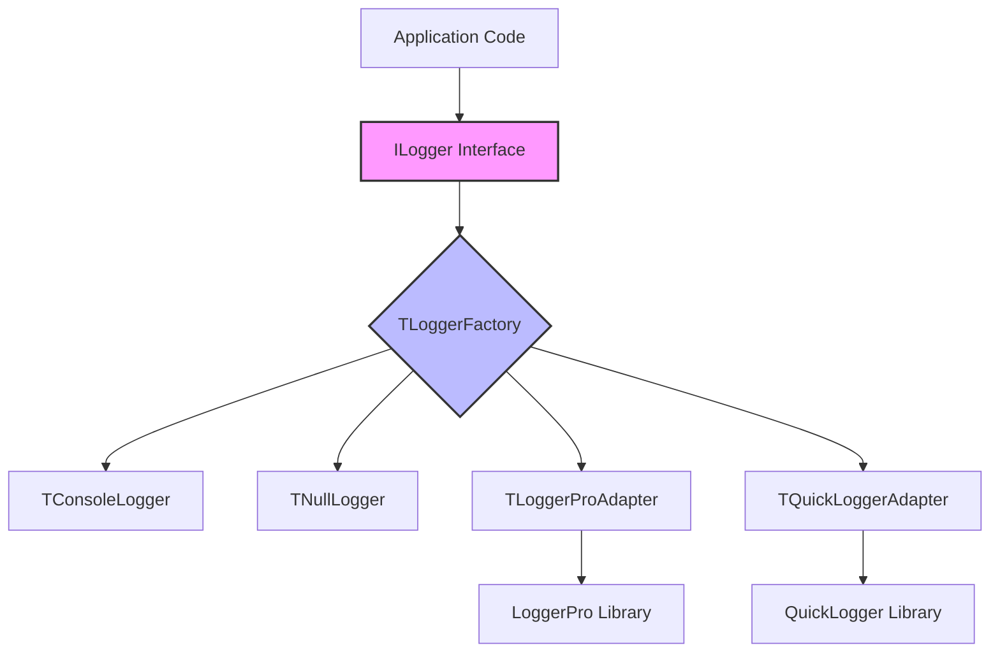

# LoggingFacade for Delphi

[](LICENSE)

A flexible, SLF4J-inspired logging facade for Delphi that decouples application code from specific logging implementations through a clean interface-based architecture.

## Table of Contents

- [Overview](#overview)
- [Key Features](#key-features)
- [Quick Start Guide](#quick-start-guide)
  - [Minimal Example](#minimal-example)
  - [With Configuration](#with-configuration)
  - [Exception Logging with Stack Traces](#exception-logging-with-stack-traces)
- [ILogger Interface](#ilogger-interface)
  - [Logging Methods](#logging-methods)
  - [Complete Interface Definition](#complete-interface-definition)
  - [Usage Examples](#usage-examples)
- [Hierarchical Configuration System](#hierarchical-configuration-system)
  - [Understanding LoggerFactory](#understanding-loggerfactory)
  - [Hierarchical Logger Names](#hierarchical-logger-names)
  - [Configuration Files](#configuration-files)
  - [Wildcard Patterns](#wildcard-patterns)
  - [Runtime Configuration](#runtime-configuration)
- [Installation](#installation)
  - [Dynamic Linking (BPL)](#dynamic-linking-bpl)
  - [Static Linking (Source Files)](#static-linking-source-files)
- [Advanced Usage](#advanced-usage)
  - [Using Visual Component](#using-visual-component)
  - [Using LoggerPro Adapter](#using-loggerpro-adapter)
  - [Using QuickLogger Adapter](#using-quicklogger-adapter)
  - [Custom Logger Implementation](#custom-logger-implementation)
  - [Stack Trace Configuration](#stack-trace-configuration)
- [Examples](#examples)
- [Best Practices](#best-practices)
- [Architecture](#architecture)
  - [Design Principles](#design-principles)
  - [Component Architecture](#component-architecture)
  - [Thread Safety](#thread-safety)
- [Log Levels](#log-levels)
- [Configuration Reference](#configuration-reference)
- [API Reference](#api-reference)
- [Troubleshooting](#troubleshooting)
- [Migration Guide](#migration-guide)

## Overview

LoggingFacade provides a unified logging interface for Delphi applications, allowing you to write code against a common API while switching between different logging implementations as needed. Inspired by SLF4J (Simple Logging Facade for Java) and Logback, it brings enterprise-grade logging patterns to the Delphi ecosystem.

**Perfect for:**
- Large applications with multiple teams or modules
- Library development without forcing specific logging implementations
- Microservices with different logging strategies per service
- High-performance services (REST APIs, mORMot servers, WebBroker applications)
- Testing environments requiring easy mocking or disabling of logs

## Key Features

- **🎭 Interface-Based Design**: Application code depends only on `ILogger` interface
- **🌳 Hierarchical Logger Names**: SLF4J/Logback-style hierarchical logger management with `TLoggerFactory`
- **🎯 Composite Pattern**: All loggers are composites - dynamically add/remove destinations at runtime
- **⚙️ External Configuration**: Properties files with hierarchical resolution and wildcards
- **🔄 Hot Reload**: Runtime configuration changes without restart
- **📚 Multiple Implementations**: Console, Null, LoggerPro, QuickLogger adapters
- **🎨 Visual Component**: VCL/FMX component with automatic main thread synchronization
- **🔍 Stack Trace Support**: Optional exception stack traces with JCL Debug
- **🔒 Thread-Safe**: Concurrent-safe factory, configuration, and automatic thread synchronization
- **⚡ Performance Optimized**: Logger caching, lazy initialization, single-point filtering

## Quick Start Guide

### Minimal Example

Get started in 30 seconds:

```delphi
program QuickStart;

uses
  Logger.Factory, Logger.Intf;

var
  Logger: ILogger;
begin
  // Get a logger (uses default console logger)
  Logger := TLoggerFactory.GetLogger('MyApp');

  // Log messages
  Logger.Info('Application started');
  Logger.Debug('Processing data...');
  Logger.Error('Something went wrong!');
end.
```

### With Configuration

Create `logging.properties`:
```properties
root=WARN
MyApp=DEBUG
MyApp.Database=TRACE
```

```delphi
program ConfiguredLogging;

uses
  Logger.Factory, Logger.Intf, Logger.Types;

type
  TDatabaseManager = class
  private
    FLogger: ILogger;
  public
    constructor Create;
    procedure Connect;
  end;

constructor TDatabaseManager.Create;
begin
  FLogger := TLoggerFactory.GetLogger('MyApp.Database');
end;

procedure TDatabaseManager.Connect;
begin
  FLogger.Debug('Connecting to database...');
  // Connection logic
  FLogger.Info('Connected successfully');
end;

var
  DbManager: TDatabaseManager;
begin
  // Configuration loads automatically from logging.properties

  DbManager := TDatabaseManager.Create;
  try
    DbManager.Connect;
  finally
    DbManager.Free;
  end;
end.
```

### Exception Logging with Stack Traces

**When using BPL packages**, stack traces are automatically available if `LoggingFacade.StackTrace.JclDebug.bpl` is deployed - no code changes needed!

```delphi
program ExceptionLogging;

uses
  System.SysUtils,
  Logger.Factory, Logger.Intf;  // Stack trace support is automatic with BPL

procedure RiskyOperation;
var
  Logger: ILogger;
begin
  Logger := TLoggerFactory.GetLogger('MyApp.Critical');

  try
    // Something that might fail
    raise Exception.Create('Database connection lost');
  except
    on E: Exception do
    begin
      Logger.Error('Operation failed', E);  // Automatically includes stack trace if BPL is present
      raise;
    end;
  end;
end;

begin
  try
    RiskyOperation;
  except
    on E: Exception do
      WriteLn('Application error: ' + E.Message);
  end;
end.
```

## ILogger Interface

The `ILogger` interface is the core contract that all loggers implement. Your application code should depend only on this interface, never on concrete implementations.

### Logging Methods

Each log level has multiple overloads for different use cases:

```delphi
// Basic message
Logger.Info('Application started');

// Message with format arguments
Logger.Info('Processing order #%d', [OrderId]);

// Message with exception (all levels)
Logger.Error('Database connection failed', DatabaseException);
Logger.Warn('Connection unstable', ConnectionException);
Logger.Info('Recovered from error', RecoveryException);

// Message with format arguments and exception (all levels)
Logger.Error('Failed to process order #%d', [OrderId], OrderException);
```

### Complete Interface Definition

```delphi
ILogger = interface
  ['{B9A7E5D1-4F2C-4E8D-A3B6-7C8D9E0F1A2B}']

  // TRACE level - all 4 overloads
  procedure Trace(const AMessage: string); overload;
  procedure Trace(const AMessage: string; const AArgs: array of const); overload;
  procedure Trace(const AMessage: string; AException: Exception); overload;
  procedure Trace(const AMessage: string; const AArgs: array of const; AException: Exception); overload;

  // DEBUG level - all 4 overloads
  procedure Debug(const AMessage: string); overload;
  procedure Debug(const AMessage: string; const AArgs: array of const); overload;
  procedure Debug(const AMessage: string; AException: Exception); overload;
  procedure Debug(const AMessage: string; const AArgs: array of const; AException: Exception); overload;

  // INFO level - all 4 overloads
  procedure Info(const AMessage: string); overload;
  procedure Info(const AMessage: string; const AArgs: array of const); overload;
  procedure Info(const AMessage: string; AException: Exception); overload;
  procedure Info(const AMessage: string; const AArgs: array of const; AException: Exception); overload;

  // WARN level - all 4 overloads
  procedure Warn(const AMessage: string); overload;
  procedure Warn(const AMessage: string; const AArgs: array of const); overload;
  procedure Warn(const AMessage: string; AException: Exception); overload;
  procedure Warn(const AMessage: string; const AArgs: array of const; AException: Exception); overload;

  // ERROR level - all 4 overloads
  procedure Error(const AMessage: string); overload;
  procedure Error(const AMessage: string; const AArgs: array of const); overload;
  procedure Error(const AMessage: string; AException: Exception); overload;
  procedure Error(const AMessage: string; const AArgs: array of const; AException: Exception); overload;

  // FATAL level - all 4 overloads
  procedure Fatal(const AMessage: string); overload;
  procedure Fatal(const AMessage: string; const AArgs: array of const); overload;
  procedure Fatal(const AMessage: string; AException: Exception); overload;
  procedure Fatal(const AMessage: string; const AArgs: array of const; AException: Exception); overload;

  // Level checking - use before expensive operations
  function IsTraceEnabled: Boolean;
  function IsDebugEnabled: Boolean;
  function IsInfoEnabled: Boolean;
  function IsWarnEnabled: Boolean;
  function IsErrorEnabled: Boolean;
  function IsFatalEnabled: Boolean;

  // Configuration
  procedure SetLevel(ALevel: TLogLevel);
  function GetLevel: TLogLevel;
  function GetName: string;
end;
```

### Usage Examples

**Basic logging:**
```delphi
Logger.Info('User logged in');
Logger.Debug('Configuration loaded from file');
Logger.Warn('Cache miss for key: users:123');
```

**Formatted messages:**
```delphi
Logger.Info('Processing %d items in %d ms', [ItemCount, ElapsedTime]);
Logger.Debug('User %s accessed resource %s', [Username, ResourceName]);
```

**Exception logging:**
```delphi
try
  // Risky operation
  Database.Connect;
except
  on E: Exception do
  begin
    // Log with simple message
    Logger.Error('Database connection failed', E);

    // Or with formatted message
    Logger.Error('Failed to connect to %s:%d', [Host, Port], E);
    raise;
  end;
end;
```

**Performance optimization with level checks:**
```delphi
// Avoid expensive operations when level is disabled
if Logger.IsDebugEnabled then
begin
  var DebugInfo := BuildExpensiveDebugString();
  Logger.Debug('Debug info: %s', [DebugInfo]);
end;

// Simple messages don't need level checks
Logger.Info('Operation completed');  // Very low overhead
```

## Hierarchical Configuration System

**This is the most powerful feature of LoggingFacade** - it allows you to control logging output across your entire application using hierarchical logger names and configuration files.

### Understanding LoggerFactory

`TLoggerFactory` is the central component that:
- **Creates loggers** using hierarchical names (e.g., `MyApp.Database.Connection`)
- **Caches logger instances** for performance
- **Manages configuration** from `.properties` files
- **Resolves log levels** hierarchically based on logger names

Think of it as the "control center" for all your logging.

### Hierarchical Logger Names

Loggers are organized in a hierarchy using dot notation, similar to Java packages or .NET namespaces:

```delphi
var
  AppLogger := TLoggerFactory.GetLogger('MyApp');
  DbLogger := TLoggerFactory.GetLogger('MyApp.Database');
  ConnLogger := TLoggerFactory.GetLogger('MyApp.Database.Connection');
  ApiLogger := TLoggerFactory.GetLogger('MyApp.API.REST');
```

**Each logger inherits configuration from its parent:**
- `MyApp.Database.Connection` inherits from `MyApp.Database`
- `MyApp.Database` inherits from `MyApp`
- `MyApp` inherits from `root`

This means you can configure entire subsystems at once, then override specific components as needed.

### Configuration Files

Configuration files use a simple properties format:

```properties
# Root logger - fallback for everything
root=INFO

# Configure entire application at DEBUG
MyApp=DEBUG

# But database layer needs only INFO
MyApp.Database=INFO

# Except connection pool which needs TRACE for debugging
MyApp.Database.ConnectionPool=TRACE
```

**Automatic Loading:**
- **DEBUG builds**: Looks for `logging-debug.properties`
- **RELEASE builds**: Looks for `logging.properties`

**Search locations:**
1. Current directory
2. Executable directory
3. Parent of executable directory

### Wildcard Patterns

Use wildcards to configure multiple loggers at once:

```properties
# Configure all API endpoints
MyApp.API.*=WARN

# But REST endpoints need DEBUG
MyApp.API.REST=DEBUG

# Configure all repositories
*.repository=INFO
```

**Resolution rules:**
1. **Exact match wins** - `MyApp.Database.Connection` matches exactly
2. **Most specific wildcard** - `MyApp.Database.*` beats `MyApp.*`
3. **Inheritance** - Falls back to parent or root if no match

### Runtime Configuration

Change log levels at runtime without restarting your application:

```delphi
// Change single logger
TLoggerFactory.SetLoggerLevel('app.database', llTrace);

// Change with wildcard - affects all matching loggers
TLoggerFactory.SetLoggerLevel('app.api.*', llError);

// Reload configuration file
TLoggerFactory.ReloadConfig;
```

### Practical Example

```delphi
program HierarchicalDemo;

uses
  Logger.Factory, Logger.Intf, Logger.Types;

procedure InitializeLogging;
begin
  // Configure via code (or use .properties file)
  TLoggerFactory.SetLoggerLevel('app', llInfo);
  TLoggerFactory.SetLoggerLevel('app.database.*', llDebug);
  TLoggerFactory.SetLoggerLevel('app.database.connection', llTrace);
  TLoggerFactory.SetLoggerLevel('app.api.*', llError);
end;

procedure DatabaseOperation;
var
  Logger: ILogger;
begin
  Logger := TLoggerFactory.GetLogger('app.database.connection');

  Logger.Trace('Opening connection...');              // Shows (TRACE level)
  Logger.Debug('Executing query: SELECT * FROM...');  // Shows
  Logger.Info('Query executed successfully');         // Shows
end;

procedure ApiEndpoint;
var
  Logger: ILogger;
begin
  Logger := TLoggerFactory.GetLogger('app.api.users');

  Logger.Info('API called');                    // Hidden (ERROR level)
  Logger.Error('Authentication failed');        // Shows
end;

begin
  InitializeLogging;
  DatabaseOperation;
  ApiEndpoint;
end.
```

## Installation

LoggingFacade can be installed using either dynamic linking (BPL packages) or static linking (source files).

### Dynamic Linking (BPL)

Best for shared components across multiple applications.

#### 1. Compile the Packages

Open each `.dpk` file in Delphi and compile (Shift+F9):

- `packages\LoggingFacade.dpk` → Core framework (required)
- `packages\LoggingFacade.LoggerPro.dpk` → LoggerPro adapter (optional)
- `packages\LoggingFacade.QuickLogger.dpk` → QuickLogger adapter (optional)
- `packages\LoggingFacade.StackTrace.JclDebug.dpk` → Stack traces with JCL (optional, automatically detected when present)

#### 2. Deploy BPL Files

Copy the generated `.bpl` files to:
- System PATH directory, or
- Application directory

**Note:** For stack traces, simply deploy `LoggingFacade.StackTrace.JclDebug.bpl` to your application directory. When you include `Logger.StackTrace.Loader` in your code, the BPL is automatically detected and loaded. No manual configuration required.

#### 3. Configure Your Project

In Project Options → Packages → Runtime Packages:
- Check "Link with runtime packages"
- Add package names (without .bpl extension):
  ```
  LoggingFacade;LoggingFacade.LoggerPro
  ```

### Static Linking (Source Files)

Best for single applications or when you want to avoid BPL deployment.

#### 1. Add Source Path

In Project Options → Delphi Compiler → Search Path, add:
```
..\LoggingFacade\src
```

#### 2. Add Units to Your Code

```delphi
uses
  Logger.Intf,
  Logger.Factory,
  Logger.Types,
  Logger.Default;  // Or other implementations
```

#### Comparison: BPL vs Source

| Aspect | BPL (Dynamic) | Source (Static) |
|--------|---------------|-----------------|
| **Executable Size** | Smaller | Larger |
| **Deployment** | Requires BPL files | Single EXE |
| **Shared Code** | Yes, across apps | No |
| **Updates** | Update BPL only | Recompile all apps |
| **Debugging** | More complex | Straightforward |
| **Best For** | Multiple apps, plugins | Single apps |

## Advanced Usage

### Using Visual Component

LoggingFacade includes a non-visual Delphi component (`TLoggerComponent`) that provides event-driven logging for VCL and FMX applications. This allows you to handle log messages through events without writing custom logger implementations.

#### Features

- **Event-driven architecture**: Handle logs through OnTrace, OnDebug, OnInfo, OnWarn, OnError, OnFatal events
- **Fallback event**: OnMessage event fires when specific level events are not assigned
- **Thread-safe**: Automatically synchronizes events with the main thread using async `TThread.Queue`
- **Factory integration**: Activate the component to integrate with TLoggerFactory automatically
- **Automatic cleanup**: Component unregisters itself from factory on destruction

#### Quick Start

**1. Drop the component on a form:**

After installing the `LoggingFacade.Component.dpk` design-time package, find `TLoggerComponent` in the Tool Palette under the "Logging" category.

**2. Configure the component:**

```delphi
type
  TMainForm = class(TForm)
  private
    FLogger: ILogger;  // Logger instance from factory
  end;

procedure TMainForm.FormCreate(Sender: TObject);
begin
  // Configure component
  LoggerComponent1.LoggerName := 'MyApp.MainForm';
  LoggerComponent1.MinLevel := llTrace;
  LoggerComponent1.OnMessage := LoggerComponent1Message;

  // Activate to integrate with factory
  LoggerComponent1.Active := True;

  // Get logger from factory - will route to component when Active
  FLogger := TLoggerFactory.GetLogger('MyApp.MainForm');
end;
```

**3. Handle events:**

```delphi
procedure TMainForm.LoggerComponent1Message(Sender: TObject;
  const EventData: TLogEventData);
begin
  // Add to memo with formatting
  Memo1.Lines.Add(Format('[%s] %s',
    [EventData.Level.ToString, EventData.Message]));

  // Check for exceptions
  if EventData.ExceptionClass <> '' then
    Memo1.Lines.Add(Format('  Exception: %s: %s',
      [EventData.ExceptionClass, EventData.ExceptionMessage]));
end;
```

**4. Log from your code using the factory:**

```delphi
procedure TMainForm.Button1Click(Sender: TObject);
begin
  // Log via factory - automatically routes to component events
  FLogger.Info('Button clicked');
  FLogger.Debug('Processing started');
end;

procedure TMainForm.ProcessData;
begin
  FLogger.Info('Processing data...');
  try
    // Do work
    FLogger.Debug('Data processed successfully');
  except
    on E: Exception do
      FLogger.Error('Processing failed', E);
  end;
end;
```

#### Event Data Structure

Each event receives a `TLogEventData` record:

```delphi
TLogEventData = record
  Level: TLogLevel;           // Log level
  Message: string;            // Log message
  TimeStamp: TDateTime;       // When the log occurred
  ThreadId: TThreadID;        // Thread that logged
  ExceptionMessage: string;   // Exception message (if any)
  ExceptionClass: string;     // Exception class name (if any)
end;
```

#### Specific vs Fallback Events

You can handle each log level individually or use the fallback:

```delphi
// Option 1: Handle each level separately
LoggerComponent1.OnError := HandleErrorEvent;
LoggerComponent1.OnWarn := HandleWarnEvent;
LoggerComponent1.OnInfo := HandleInfoEvent;

// Option 2: Use fallback for all levels
LoggerComponent1.OnMessage := HandleAllEvents;

// Option 3: Mix both (specific events override fallback)
LoggerComponent1.OnError := HandleCriticalEvent;  // Errors handled separately
LoggerComponent1.OnMessage := HandleOtherEvents;  // All others use fallback
```

#### Integration with LoggerFactory

The `Active` property provides automatic integration with `TLoggerFactory`. **Important**: Always log through the factory, not directly via the component:

```delphi
type
  TMainForm = class(TForm)
  private
    FLogger: ILogger;
  end;

procedure TMainForm.FormCreate(Sender: TObject);
begin
  // Configure component
  LoggerComponent1.LoggerName := 'MyApp.MainForm';
  LoggerComponent1.MinLevel := llInfo;
  LoggerComponent1.OnMessage := LoggerMessage;

  // Activate to register with factory
  LoggerComponent1.Active := True;
  // Internally creates TMainThreadLogger and calls TLoggerFactory.AddLogger

  // IMPORTANT: Always get logger from factory
  FLogger := TLoggerFactory.GetLogger('MyApp.MainForm');
end;

procedure TMainForm.SomeAction;
begin
  // ✅ CORRECT: Log via factory
  FLogger.Info('This appears in the component events!');

  // ❌ WRONG: Don't call component directly
  // LoggerComponent1.Info('...');  // Don't do this!
end;
```

**How it works:**
1. When `Active := True`: Creates a `TMainThreadLogger`, attaches events, and registers with `TLoggerFactory.AddLogger`
2. `TLoggerFactory.GetLogger('MyApp.MainForm')` returns a `TCompositeLogger` containing both the default logger and the `TMainThreadLogger`
3. When you log via factory, the message goes to the composite, which broadcasts to all registered loggers including `TMainThreadLogger`
4. `TMainThreadLogger` synchronizes to main thread and fires the component events
5. When `Active := False`: Calls `TLoggerFactory.RemoveLogger` and releases the logger
6. On component destruction: Automatically sets `Active := False` to unregister

**Important notes:**
- **Always log via `TLoggerFactory.GetLogger`**, never call the component directly
- Set `LoggerName` before activating (required)
- Thread synchronization is handled automatically by `TMainThreadLogger`
- The component is automatically unregistered when destroyed
- Multiple components can use the same logger name (all receive events)
- When Active is False, logs still go to console via the default logger

#### Multi-threaded Logging Example

The component automatically handles thread synchronization via `TMainThreadLogger`:

```delphi
procedure TMainForm.TestMultiThreadClick(Sender: TObject);
var
  I: Integer;
begin
  // Thread safety is automatic - TMainThreadLogger uses TThread.Queue

  FLogger.Info('Starting multi-threaded test...');

  // Launch multiple threads
  for I := 1 to 5 do
  begin
    TTask.Run(
      procedure
      var
        ThreadLogger: ILogger;
        J: Integer;
      begin
        // Get logger from factory in each thread
        ThreadLogger := TLoggerFactory.GetLogger('MyApp.MainForm');

        for J := 1 to 100 do
        begin
          ThreadLogger.Info(Format('Thread %d - Message %d', [I, J]));
          Sleep(10);
        end;
      end);
  end;

  FLogger.Info('Test started - check the event log!');
end;
```

**Key points:**
- Get a logger instance from the factory in each thread
- All messages are automatically synchronized to the main thread
- Events fire on the main thread - safe to update UI components
- No blocking - uses async `TThread.Queue` internally

#### Properties Reference

| Property | Type | Default | Description |
|----------|------|---------|-------------|
| **LoggerName** | string | '' | Logger name for factory integration (required before activating) |
| **MinLevel** | TLogLevel | llTrace | Minimum log level to process |
| **Active** | Boolean | False | When True, registers with TLoggerFactory; False unregisters |
| **OnTrace** | TLogEvent | nil | TRACE level event |
| **OnDebug** | TLogEvent | nil | DEBUG level event |
| **OnInfo** | TLogEvent | nil | INFO level event |
| **OnWarn** | TLogEvent | nil | WARN level event |
| **OnError** | TLogEvent | nil | ERROR level event |
| **OnFatal** | TLogEvent | nil | FATAL level event |
| **OnMessage** | TLogEvent | nil | Fallback event for all levels |

#### Complete Example

See `examples\ComponentExample\` for a complete VCL application demonstrating:
- Event handling with colored output
- Active property for factory integration
- Multi-threaded logging with automatic synchronization
- Exception logging
- Runtime level changes
- Automatic cleanup on component destruction

### Using LoggerPro Adapter

LoggerPro provides high-performance asynchronous logging with multiple appenders.

```delphi
program LoggerProExample;

uses
  Logger.Factory,
  Logger.Intf,
  Logger.LoggerPro.Factory,  // Helper for LoggerPro setup
  LoggerPro,                  // LoggerPro library
  LoggerPro.FileAppender;     // File output

begin
  // Configure LoggerPro with file appender
  var LogWriter := BuildLogWriter([
    TLoggerProFileAppender.Create(10, 5000, 'logs', [], TEncoding.UTF8)
  ]);

  // Create adapter factory
  TLoggerFactory.SetNamedLoggerFactory(
    function(const AName: string): ILogger
    begin
      Result := TLoggerProAdapter.Create(AName, LogWriter);
    end
  );

  // Use as normal
  var Logger := TLoggerFactory.GetLogger('MyApp');
  Logger.Info('Using LoggerPro backend!');
end.
```

### Using QuickLogger Adapter

QuickLogger offers extensive providers for various outputs.

```delphi
program QuickLoggerExample;

uses
  Logger.Factory,
  Logger.Intf,
  Logger.QuickLogger.Adapter,
  Quick.Logger,
  Quick.Logger.Provider.Files,
  Quick.Logger.Provider.Console;

begin
  // Configure QuickLogger
  Logger.Providers.Add(GlobalLogFileProvider);
  Logger.Providers.Add(GlobalLogConsoleProvider);

  GlobalLogFileProvider.FileName := 'app.log';
  GlobalLogFileProvider.Enabled := True;

  GlobalLogConsoleProvider.Enabled := True;
  GlobalLogConsoleProvider.ShowColors := True;

  // Set up adapter factory
  TLoggerFactory.SetNamedLoggerFactory(
    function(const AName: string): ILogger
    begin
      Result := TQuickLoggerAdapter.Create(AName);
    end
  );

  // Use facade interface
  var AppLogger := TLoggerFactory.GetLogger('MyApp');
  AppLogger.Info('QuickLogger backend active');
end.
```

### Using Composite Logger

The composite logger allows you to broadcast log messages to multiple destinations simultaneously without coupling your code to specific implementations.

```delphi
program CompositeLoggerExample;

uses
  Logger.Factory,
  Logger.Intf,
  Logger.Composite,
  Logger.Default,
  Logger.QuickLogger.Adapter,
  Quick.Logger,
  Quick.Logger.Provider.Files;

var
  CompositeLogger: ILogger;
  ConsoleLogger: ILogger;
  FileLogger: ILogger;
begin
  // Create composite logger
  CompositeLogger := TCompositeLogger.Create('MyApp');

  // Create individual loggers
  ConsoleLogger := TConsoleLogger.Create('MyApp', llDebug, True);

  // Configure QuickLogger for file output
  GlobalLogFileProvider.FileName := 'app.log';
  GlobalLogFileProvider.Enabled := True;
  FileLogger := TQuickLoggerAdapter.Create('MyApp');

  // Add loggers to composite
  TCompositeLogger(CompositeLogger).AddLogger(ConsoleLogger);
  TCompositeLogger(CompositeLogger).AddLogger(FileLogger);

  // This message will be sent to both console and file
  CompositeLogger.Info('Application started');
  CompositeLogger.Debug('Processing data...');

  // Remove a logger at runtime
  TCompositeLogger(CompositeLogger).RemoveLogger(FileLogger);

  // This will only go to console
  CompositeLogger.Info('File logging disabled');

  // Get logger count
  WriteLn('Active loggers: ', TCompositeLogger(CompositeLogger).GetLoggerCount);
end.
```

**Key Features:**
- Broadcast messages to multiple loggers simultaneously
- Add/remove loggers dynamically at runtime
- Thread-safe for concurrent access
- Single-point filtering: The composite handles all level filtering efficiently
- Perfect for logging to multiple destinations (console + file, file + remote service, etc.)

**Level Management:**
The composite logger uses a "single-point filtering" strategy:
- When you add a logger to the composite, it's automatically set to TRACE level
- The composite logger becomes the only filter point
- This prevents double-filtering and ensures consistent behavior
- Changing the composite's level affects what all sub-loggers receive

```delphi
var
  Composite: ILogger;
  Console: ILogger;
begin
  Composite := TCompositeLogger.Create('MyApp', llInfo);
  Console := TConsoleLogger.Create('', llWarn); // Created with WARN level

  TCompositeLogger(Composite).AddLogger(Console);
  // Console is now automatically set to TRACE
  // Only the composite filters at INFO level

  Composite.Debug('Hidden');  // Filtered by composite
  Composite.Info('Visible');  // Passes composite filter, sent to console
end;
```

**Common Use Cases:**
```delphi
// Example 1: Console + File logging
var Composite := TCompositeLogger.Create('MyApp', llInfo);
TCompositeLogger(Composite).AddLogger(TConsoleLogger.Create);
TCompositeLogger(Composite).AddLogger(TFileLogger.Create('app.log'));
// Both loggers will receive INFO and above messages

// Example 2: Change logging level at runtime
var Composite := TCompositeLogger.Create('MyApp', llInfo);
TCompositeLogger(Composite).AddLogger(TConsoleLogger.Create);
TCompositeLogger(Composite).AddLogger(TFileLogger.Create('app.log'));

// Later, enable debug logging for troubleshooting
Composite.SetLevel(llDebug);
// Now both console and file receive DEBUG messages

// Example 3: Development vs Production logging
var Composite: ILogger;
{$IFDEF DEBUG}
  Composite := TCompositeLogger.Create('MyApp', llTrace);
  TCompositeLogger(Composite).AddLogger(TConsoleLogger.Create);
  TCompositeLogger(Composite).AddLogger(TFileLogger.Create('debug.log'));
{$ELSE}
  Composite := TCompositeLogger.Create('MyApp', llInfo);
  TCompositeLogger(Composite).AddLogger(TFileLogger.Create('production.log'));
  TCompositeLogger(Composite).AddLogger(TRemoteLogger.Create('log-server'));
{$ENDIF}
```

### Custom Logger Implementation

Create your own logger by implementing the `ILogger` interface:

```delphi
unit MyCustomLogger;

interface

uses
  Logger.Intf, Logger.Types, System.SysUtils;

type
  TDatabaseLogger = class(TInterfacedObject, ILogger)
  private
    FName: string;
    FMinLevel: TLogLevel;
    procedure WriteToDatabase(ALevel: TLogLevel; const AMessage: string);
  public
    constructor Create(const AName: string);

    // ILogger implementation
    procedure Trace(const AMessage: string); overload;
    procedure Trace(const AMessage: string; const AArgs: array of const); overload;
    // ... implement all ILogger methods ...

    function IsTraceEnabled: Boolean;
    // ... implement all level check methods ...

    procedure SetLevel(ALevel: TLogLevel);
    function GetLevel: TLogLevel;
    function GetName: string;
  end;

implementation

constructor TDatabaseLogger.Create(const AName: string);
begin
  FName := AName;
  FMinLevel := llInfo;
end;

procedure TDatabaseLogger.WriteToDatabase(ALevel: TLogLevel; const AMessage: string);
begin
  // Insert log entry into database
  // ExecuteSQL('INSERT INTO logs (level, logger, message) VALUES (?, ?, ?)',
  //   [ALevel.ToString, FName, AMessage]);
end;

procedure TDatabaseLogger.Info(const AMessage: string);
begin
  if FMinLevel <= llInfo then
    WriteToDatabase(llInfo, AMessage);
end;

// ... implement other methods ...

end.
```

Register your custom logger:

```delphi
TLoggerFactory.SetNamedLoggerFactory(
  function(const AName: string): ILogger
  begin
    Result := TDatabaseLogger.Create(AName);
  end
);
```

### Stack Trace Configuration

**Stack traces are automatically enabled when the appropriate BPL is present.** When using `LoggingFacade.bpl`, simply deploy `LoggingFacade.StackTrace.JclDebug.bpl` alongside your executable - no code changes or manual configuration required!

#### Dynamic Loading with BPL Packages (Production - Recommended)

**Fully Automatic - Zero Configuration:**

When you use the `LoggingFacade.bpl` package:
1. The stack trace loader is automatically included in the BPL
2. When you create your first logger via `TLoggerFactory.GetLogger`, the framework automatically:
   - Searches for `LoggingFacade.StackTrace.JclDebug.bpl` in the executable directory and LoggingFacade.bpl directory
   - Loads the BPL dynamically if found
   - Enables stack trace support transparently
   - Falls back gracefully if the BPL is not present (no errors, just no stack traces)

**Usage:**

```delphi
uses
  Logger.Factory, Logger.Intf;  // No need to include Logger.StackTrace.Loader!

begin
  // Stack traces automatically available if BPL is deployed
  var Logger := TLoggerFactory.GetLogger('MyApp');
  try
    raise Exception.Create('Test error');
  except
    on E: Exception do
      Logger.Error('Operation failed', E);  // Includes stack trace if BPL present
  end;
end.
```

**Deployment:**
- Copy `LoggingFacade.StackTrace.JclDebug.bpl` to your application directory
- Stack traces will automatically be enabled
- If BPL is missing, logging continues normally without stack traces
- No uses clause changes needed!

#### Static Linking (Development)

**For static linking (compiling source files directly instead of using BPLs):**

When NOT using `LoggingFacade.bpl`, you have two options:

**Option 1: Include the loader manually**
```delphi
uses
  Logger.Factory, Logger.Intf,
  Logger.StackTrace.Loader;  // Required when statically linking

begin
  // Stack traces automatically enabled if BPL is found
  var Logger := TLoggerFactory.GetLogger('MyApp');
  try
    raise Exception.Create('Test error');
  except
    on E: Exception do
      Logger.Error('Operation failed', E);
  end;
end.
```

**Option 2: Direct JCL linking (no BPL needed)**
```delphi
uses
  Logger.Factory, Logger.Intf,
  Logger.StackTrace.JclDebug;  // Direct JCL dependency, no BPL required

begin
  // Stack traces available immediately
  var Logger := TLoggerFactory.GetLogger('MyApp');
  try
    raise Exception.Create('Test error');
  except
    on E: Exception do
      Logger.Error('Operation failed', E);
  end;
end.
```

#### Manual Control

```delphi
// Check availability
if TStackTraceManager.IsAvailable then
  WriteLn('Stack traces enabled')
else
  WriteLn('Stack traces not available');

// Enable/disable at runtime
TStackTraceManager.Disable;  // Temporarily disable
TStackTraceManager.Enable;   // Re-enable

// Get current stack
var Stack := TStackTraceManager.GetCurrentStackTrace;
Logger.Debug('Current call stack: ' + Stack);
```

## Examples

The project includes several example applications demonstrating different features:

### BasicExample
Simple introduction to logging with different levels and basic configuration.

```bash
examples\BasicExample\BasicExample.dpr
```

### ConfigExample
Demonstrates external configuration files, hierarchical resolution, and runtime changes.

```bash
examples\ConfigExample\ConfigExample.dpr
```

### HierarchicalDemo
Complex multi-layer application showing hierarchical loggers across different modules.

```bash
examples\HierarchicalDemo\HierarchyApp\HierarchyApp.dpr
```

### StackTraceExample
Shows exception logging with stack traces using JCL Debug.

```bash
examples\StackTraceExample\StackTraceExample.dpr
```

### LoggerProExample
Integration with LoggerPro library for high-performance logging.

```bash
examples\LoggerProExample\LoggerProExample.dpr
```

### QuickLoggerExample
Integration with QuickLogger for feature-rich logging.

```bash
examples\QuickLoggerExample\QuickLoggerExample.dpr
```

### ComponentExample
VCL application demonstrating the visual logging component with event-driven architecture.

```bash
examples\ComponentExample\ComponentExample.dpr
```

## Best Practices

### Logger Naming Conventions

1. **Mirror your code structure**
   ```delphi
   'MyApp.UI.Forms.MainForm'
   'MyApp.Business.Services.OrderService'
   'MyApp.Data.Repositories.CustomerRepository'
   ```

2. **Use constants for logger names**
   ```delphi
   const
     LOG_DATABASE = 'MyApp.Database';
     LOG_API = 'MyApp.API';
   ```

3. **One logger per class**
   ```delphi
   type
     TMyService = class
     private
       class var FLogger: ILogger;
     public
       class constructor Create;
     end;

   class constructor TMyService.Create;
   begin
     FLogger := TLoggerFactory.GetLogger('MyApp.Services.MyService');
   end;
   ```

### Performance Considerations

1. **Cache logger instances**
   ```delphi
   // Bad - creates logger every time
   procedure DoWork;
   begin
     TLoggerFactory.GetLogger('MyApp').Info('Working...');
   end;

   // Good - reuses cached instance
   var
     Logger: ILogger;

   procedure DoWork;
   begin
     if not Assigned(Logger) then
       Logger := TLoggerFactory.GetLogger('MyApp');
     Logger.Info('Working...');
   end;
   ```

2. **Check level before expensive operations**
   ```delphi
   if Logger.IsDebugEnabled then
   begin
     var Data := CollectDebugData();  // Expensive
     Logger.Debug('Data: ' + Data);
   end;
   ```

3. **Use format strings efficiently**
   ```delphi
   // Good - defers formatting
   Logger.Info('Order %d processed in %d ms', [OrderId, ElapsedMs]);

   // Less efficient - always formats
   Logger.Info(Format('Order %d processed in %d ms', [OrderId, ElapsedMs]));
   ```

### Configuration Management

1. **Separate configs for environments**
   ```
   logging-debug.properties     # Development
   logging.properties           # Production
   logging-test.properties      # Testing
   ```

2. **Start general, get specific**
   ```properties
   # Start with broad rules
   root=WARN
   app.*=INFO

   # Then add specific overrides
   app.database.connection=DEBUG
   app.critical.security=TRACE
   ```

3. **Document your configuration**
   ```properties
   # ===== Production Configuration =====
   # Root: WARN to minimize noise
   # Database: INFO for operations tracking
   # API: ERROR only for production stability

   root=WARN
   app.database=INFO
   app.api=ERROR
   ```

### Deployment Strategies

#### Development
- Use source files for easy debugging
- Enable TRACE/DEBUG levels
- Include stack trace support
- Use console logger for immediate feedback

#### Testing
- Use null logger for unit tests
- Mock ILogger interface for behavior testing
- Separate test configuration file

#### Production
- Use BPL packages for shared deployment
- Configure appropriate log levels (usually INFO/WARN)
- Use production-grade backend (LoggerPro/QuickLogger)
- Implement log rotation and archiving
- Consider performance impact of logging

## Architecture

LoggingFacade implements the **Facade Pattern** to provide a simplified, unified interface to various logging subsystems:



### Design Principles

1. **Facade Pattern**: Single interface (`ILogger`) hiding implementation complexity
2. **Factory Pattern**: Centralized logger creation via `TLoggerFactory`
3. **Singleton Pattern**: Single factory instance with cached loggers
4. **Adapter Pattern**: Bridges to external logging libraries
5. **Registry Pattern**: Dynamic provider registration for stack traces

### Component Architecture

#### Core Package (LoggingFacade.bpl)
- `Logger.Intf.pas` - Core `ILogger` interface
- `Logger.Factory.pas` - Factory with hierarchical logger management and composite pattern
- `Logger.Config.pas` - Configuration file parser with wildcards
- `Logger.Types.pas` - Common types, log levels, and event data structures
- `Logger.Default.pas` - Console logger implementation
- `Logger.Null.pas` - Null logger (no output)
- `Logger.Composite.pas` - Composite logger (multiple destination aggregator)
- `Logger.MainThread.pas` - Main thread logger with event-driven architecture
- `Logger.StackTrace.pas` - Stack trace registry

#### Component Package (LoggingFacade.Component.dpk)
- `Logger.Component.pas` - VCL/FMX non-visual component for event-driven logging
- `Logger.Component.Adapter.pas` - Adapter to integrate TLoggerComponent with ILogger
- `Logger.Component.Reg.pas` - Component registration for IDE

#### Adapter Packages
- `LoggingFacade.LoggerPro.bpl` - LoggerPro integration
- `LoggingFacade.QuickLogger.bpl` - QuickLogger integration
- `LoggingFacade.StackTrace.JclDebug.bpl` - JCL Debug provider

### Thread Safety

All core components are designed to be thread-safe:

1. **TLoggerFactory**: Uses critical section for all operations
2. **TConsoleLogger**: Synchronizes console output
3. **TLoggerConfig**: Thread-safe configuration access
4. **TLoggerContext**: Thread-local storage for contexts
5. **Adapters**: Rely on underlying library's thread safety

## Log Levels

LoggingFacade supports six log levels, ordered from most verbose to most severe:

| Level | Usage | Example |
|-------|-------|---------|
| **TRACE** | Very detailed information, typically only enabled during development | Method entry/exit, variable values |
| **DEBUG** | Detailed information useful for debugging | SQL queries, configuration values |
| **INFO** | General informational messages | Application startup, feature usage |
| **WARN** | Potentially harmful situations | Deprecated API usage, poor performance |
| **ERROR** | Error events that might still allow the application to continue | Failed operations, invalid input |
| **FATAL** | Very severe error events that will presumably lead the application to abort | Out of memory, critical resource unavailable |

### Level Filtering

Each logger has a minimum level - messages below this level are discarded:

```delphi
var Logger := TLoggerFactory.GetLogger('MyApp');
Logger.SetLevel(llInfo);

Logger.Trace('Hidden');  // Not logged
Logger.Debug('Hidden');  // Not logged
Logger.Info('Visible');  // Logged
Logger.Warn('Visible');  // Logged
```

### Performance Optimization with Level Checks

Always check if a level is enabled before expensive operations:

```delphi
// Bad - always builds the expensive string
Logger.Debug('Data: ' + ExpensiveDataDump());

// Good - only builds string if DEBUG is enabled
if Logger.IsDebugEnabled then
  Logger.Debug('Data: ' + ExpensiveDataDump());
```

## Configuration Reference

### Properties File Syntax

```properties
# Comment line
! Alternative comment

# Root logger
root=LEVEL

# Named logger
logger.name=LEVEL

# Wildcard pattern
logger.prefix.*=LEVEL

# Levels: TRACE, DEBUG, INFO, WARN, ERROR, FATAL
```

### Configuration Options

| Property | Description | Example |
|----------|-------------|---------|
| `root` | Default level for all loggers | `root=INFO` |
| `*` | Same as root | `*=WARN` |
| `name` | Exact logger name | `myapp.database=DEBUG` |
| `prefix.*` | All loggers starting with prefix | `myapp.*=INFO` |
| `*.suffix` | All loggers ending with suffix | `*.repository=DEBUG` |

### Configuration Precedence

1. Exact match (highest priority)
2. Longest matching wildcard
3. Shorter wildcards
4. Root logger (lowest priority)

### Runtime Configuration API

```delphi
// Load configuration file
TLoggerFactory.LoadConfig('custom.properties');

// Reload current configuration
TLoggerFactory.ReloadConfig;

// Set level for specific logger
TLoggerFactory.SetLoggerLevel('app.database', llDebug);

// Set level with wildcard
TLoggerFactory.SetLoggerLevel('app.*', llInfo);

// Query configured level
var Level := TLoggerFactory.GetConfiguredLevel('app.database');

// Clear all configuration
TLoggerFactory.ClearConfig;
```

## API Reference

### TLoggerFactory

Central factory for creating and managing logger instances.

```delphi
class function GetLogger(const AName: string = ''): ILogger;
// Get a logger instance. Empty name returns root logger.

class procedure SetLoggerFactory(AFactoryFunc: TLoggerFactoryFunc);
// Set custom factory function for creating loggers.

class procedure SetLogger(ALogger: ILogger);
// Set a specific logger instance to use globally.

class procedure UseConsoleLogger(AMinLevel: TLogLevel = llInfo;
                                 AUseColors: Boolean = True);
// Configure factory to use console logger.

class procedure UseNullLogger;
// Configure factory to use null logger (no output).

class procedure LoadConfig(const AFileName: string = '');
// Load configuration from properties file.

class procedure ReloadConfig;
// Reload current configuration file.

class procedure SetLoggerLevel(const ALoggerName: string;
                              ALevel: TLogLevel);
// Set logger level at runtime.

class function GetConfiguredLevel(const ALoggerName: string;
                                 ADefaultLevel: TLogLevel = llInfo): TLogLevel;
// Get configured level for a logger name.
```

### ILogger Interface

Core logging interface that all loggers implement.

See the complete [ILogger Interface](#ilogger-interface) section for full documentation with usage examples.

### TStackTraceManager

Manages stack trace providers for exception logging.

```delphi
class procedure RegisterProviderClass(AClass: TStackTraceProviderClass);
// Register a provider class for lazy instantiation.

class procedure SetProvider(AProvider: IStackTraceProvider);
// Set provider instance directly.

class procedure Enable;
// Enable stack trace capture.

class procedure Disable;
// Disable stack trace capture.

class function IsAvailable: Boolean;
// Check if stack traces are available.

class function GetStackTrace(AException: Exception): string;
// Get stack trace for an exception.

class function GetCurrentStackTrace: string;
// Get current call stack.
```

## Troubleshooting

### Common Issues

#### Logger Shows Nothing
- **Check configuration file** exists and is loaded
- **Verify log level** - default is INFO, DEBUG/TRACE won't show
- **Ensure correct logger name** in configuration matches code

#### Configuration Not Loading
- **File location** - must be in current/exe directory
- **File name** - `logging-debug.properties` for DEBUG, `logging.properties` for RELEASE
- **Syntax errors** - check for typos in properties file

#### BPL Not Found
- **Check BPL path** - must be in system PATH or app directory
- **Version mismatch** - rebuild BPLs with same Delphi version
- **Dependencies** - ensure LoggerPro/QuickLogger installed if using adapters

#### Stack Traces Not Working
- **JCL not installed** - requires JEDI Code Library
- **Debug info disabled** - enable in project options
- **Release mode** - stack traces disabled by default in RELEASE

### Debug Tips

1. **Enable TRACE level** to see everything:
   ```delphi
   TLoggerFactory.UseConsoleLogger(llTrace);
   ```

2. **Check logger name resolution**:
   ```delphi
   var Level := TLoggerFactory.GetConfiguredLevel('MyApp.Database');
   WriteLn('Level for MyApp.Database: ', Level.ToString);
   ```

3. **Verify configuration loading**:
   ```delphi
   try
     TLoggerFactory.LoadConfig('myconfig.properties');
     WriteLn('Config loaded successfully');
   except
     on E: Exception do
       WriteLn('Config error: ', E.Message);
   end;
   ```

4. **Test with simple console logger first**:
   ```delphi
   TLoggerFactory.UseConsoleLogger(llTrace, True);
   var Logger := TLoggerFactory.GetLogger('Test');
   Logger.Trace('If you see this, logging works!');
   ```

## Migration Guide

### From Direct LoggerPro Usage

Before (direct LoggerPro):
```delphi
uses
  LoggerPro;

begin
  Log.Info('Starting application');
  Log.Debug('Debug info');
end;
```

After (with facade):
```delphi
uses
  Logger.Factory, Logger.Intf,
  Logger.LoggerPro.Factory;  // One-time setup

begin
  // Setup (once at app start)
  ConfigureLoggerPro;  // Your LoggerPro configuration

  // Usage (throughout app)
  var Logger := TLoggerFactory.GetLogger('MyApp');
  Logger.Info('Starting application');
  Logger.Debug('Debug info');
end;
```

### From Direct QuickLogger Usage

Before (direct QuickLogger):
```delphi
uses
  Quick.Logger;

begin
  Logger.Info('Processing started');
  Logger.Error('An error occurred');
end;
```

After (with facade):
```delphi
uses
  Logger.Factory, Logger.Intf,
  Logger.QuickLogger.Adapter;

begin
  // Setup (once)
  TLoggerFactory.SetNamedLoggerFactory(
    function(const AName: string): ILogger
    begin
      Result := TQuickLoggerAdapter.Create(AName);
    end
  );

  // Usage
  var Logger := TLoggerFactory.GetLogger('MyApp');
  Logger.Info('Processing started');
  Logger.Error('An error occurred');
end;
```

### Benefits After Migration

1. **Flexibility** - Switch logging implementations without changing code
2. **Testability** - Easy to mock ILogger interface
3. **Configuration** - External configuration files
4. **Consistency** - Same API across all loggers
5. **Performance** - Logger caching and lazy initialization

---

## License

This project is licensed under the MIT License - see the LICENSE file for details.

## Contributing

Contributions are welcome! Please feel free to submit a Pull Request.

## Support

For issues, questions, or suggestions, please open an issue on the GitHub repository.